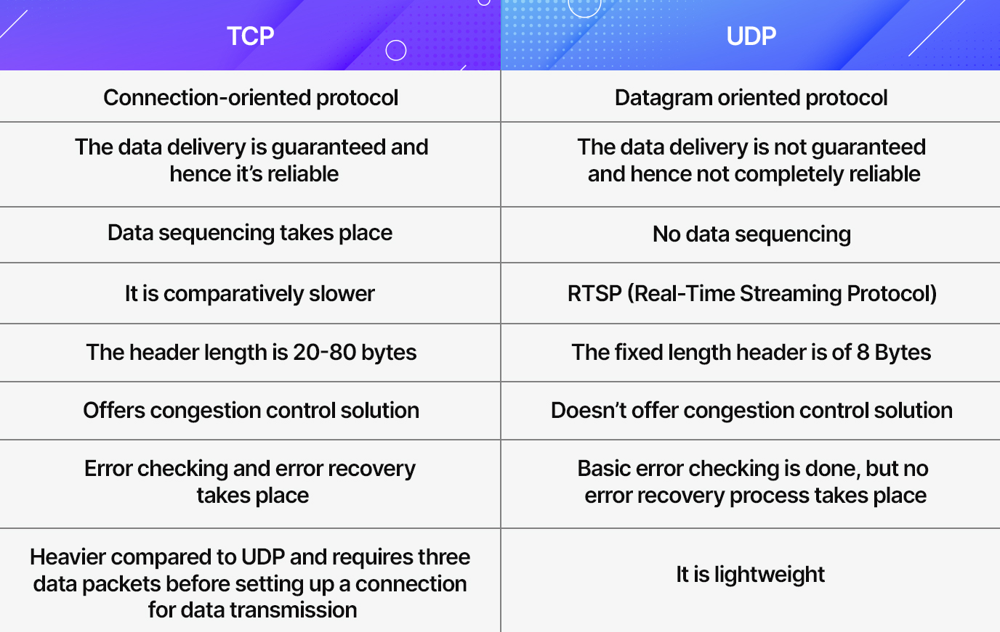

# tcp vs udp

## tcp

- orientato alla conessione
- non lascia paccheti in giro 
- sicuro per l'arrivo di segmenti ordinati

## udp

- non orientato alla conessione
- se il desitnatario e assente il pacheto sparice
- se i paccheti si perdono non cambia niente
- modalita di comunicazione
  - unicast
  - multicast
  - brodcast
- i tutti segmenti arrivano quando arrivano

